# ProjectExhibition

## AI商品花字生成(商品图vs商品花字图)

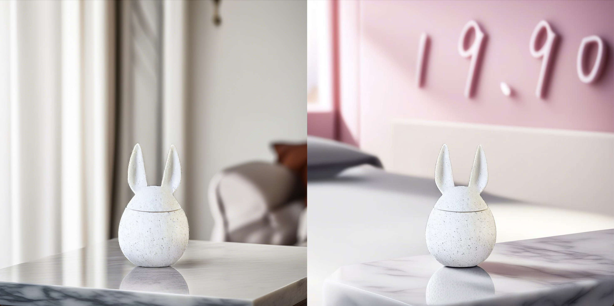
## 文生图文字生成[whee]
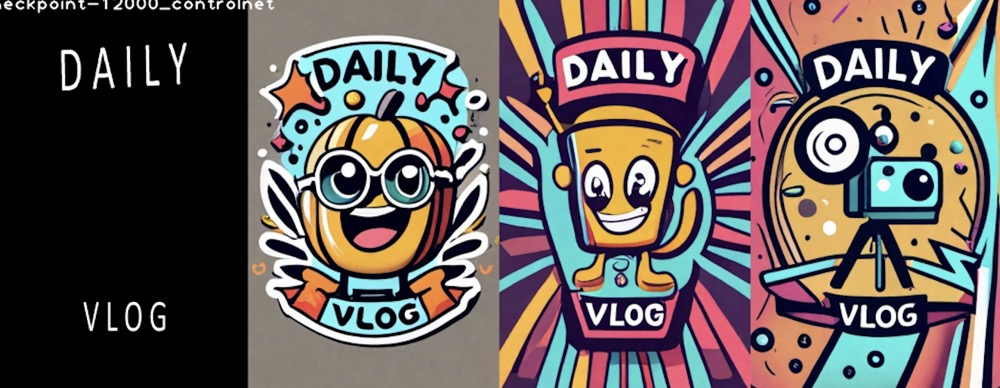
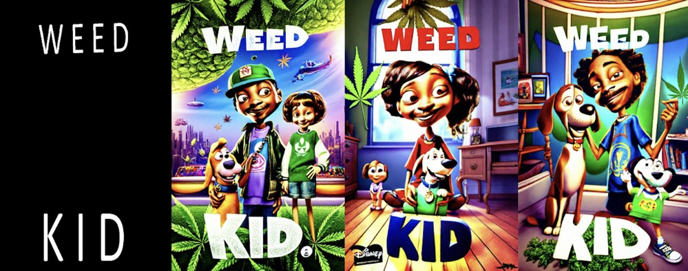
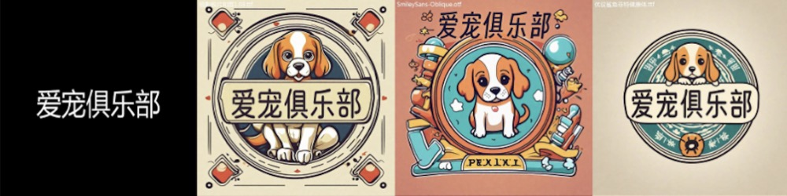
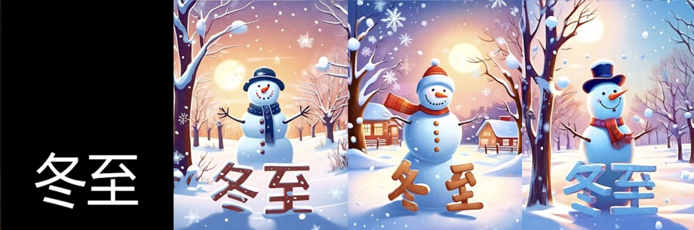
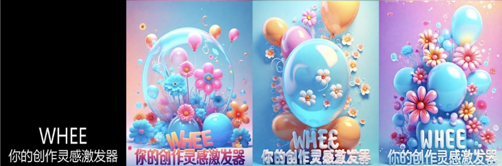
## AI写真大片[美颜相机概念写真]

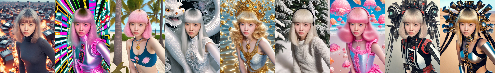
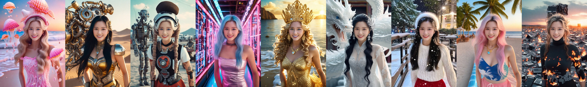

## ZSP 人脸合成ID身份保持
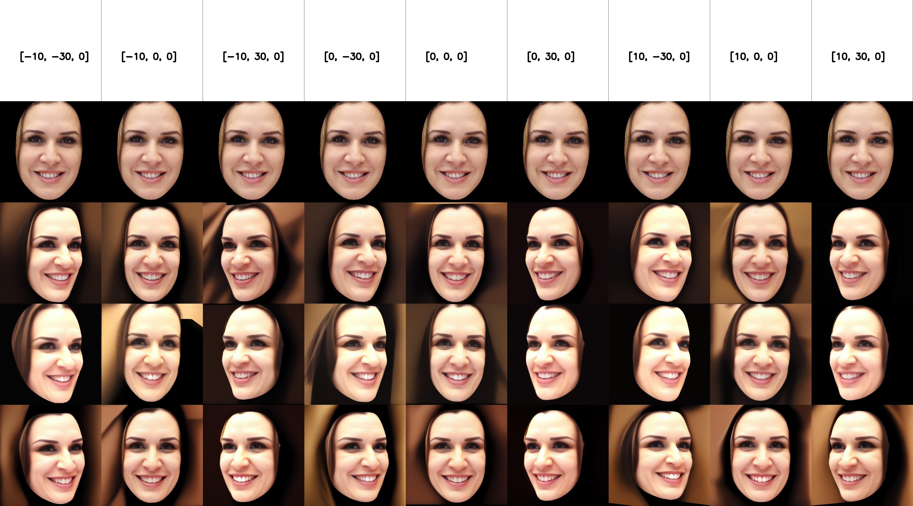
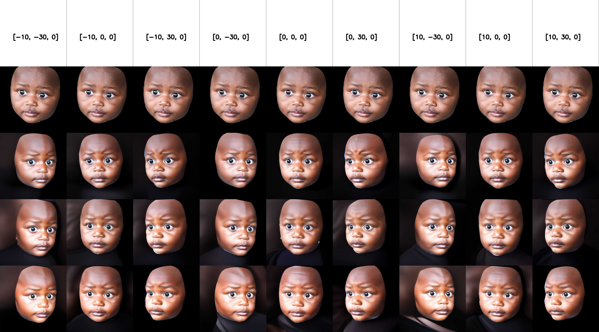

## multi-view 人脸生成
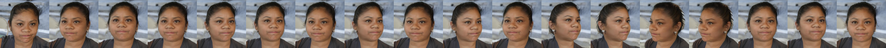

## 3D Seamless Texture（连续纹理）[whee]
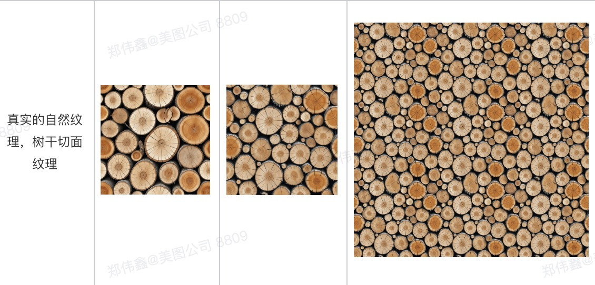
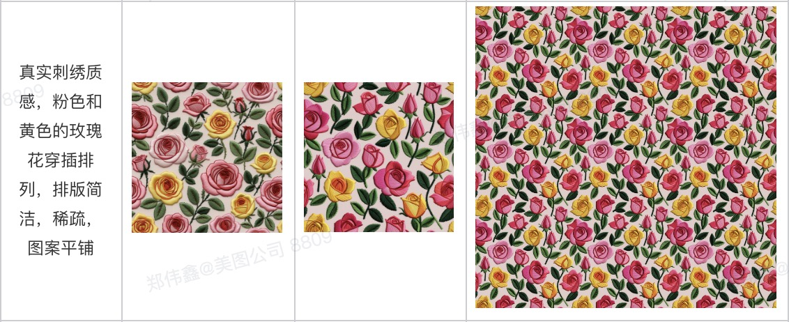

## 3DGS三维高斯泼溅

## 人脸表情驱动[DreamAvatar]
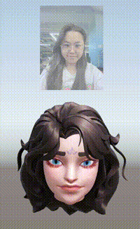
## 通用目标跟踪(优化前vs优化后)[wink]
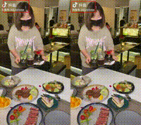
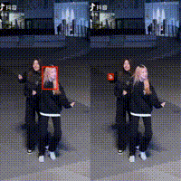

## 三维人脸重建[相机-3D素材]
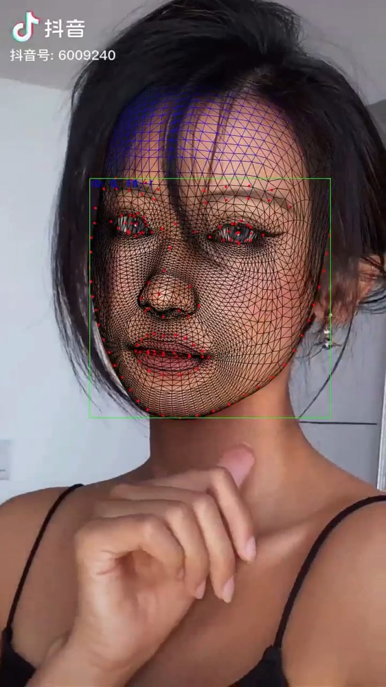
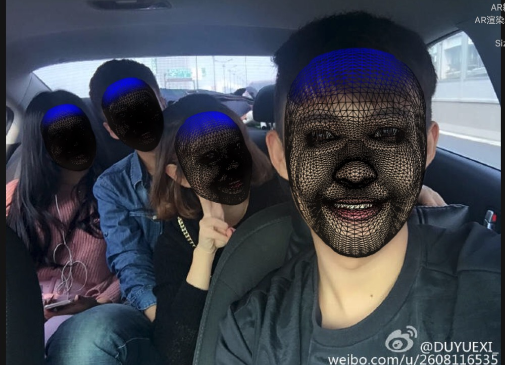
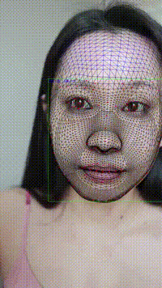
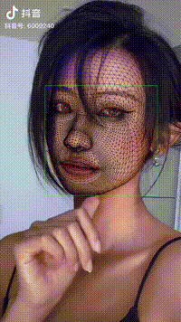