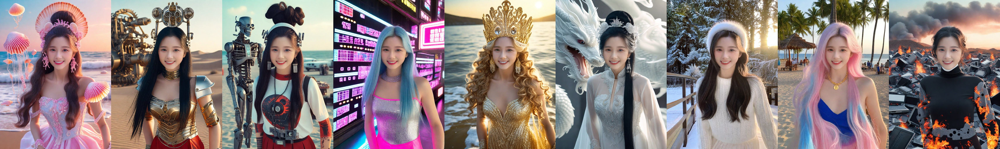
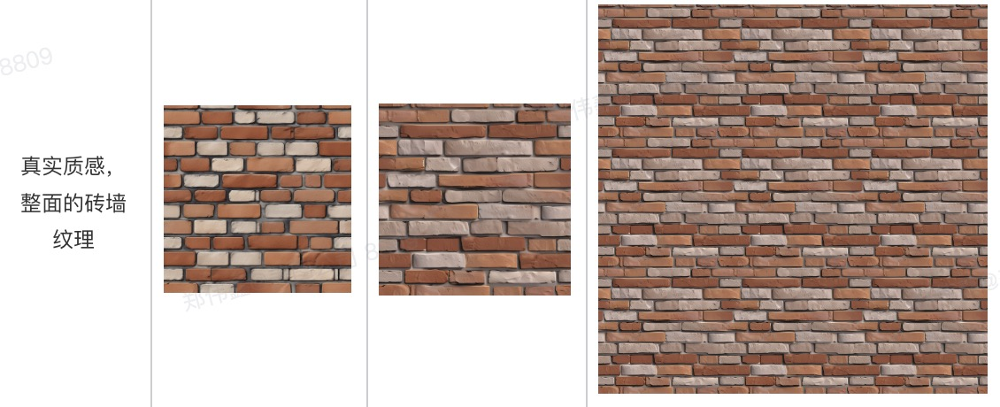
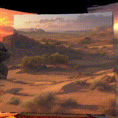

# ProjectExhibition

## AI商品花字生成(商品图vs商品花字图)

## 文生图文字生成[whee]

## AI写真大片[美颜相机概念写真]

## ZSP 人脸合成ID身份保持

## multi-view 人脸生成

## 3D Seamless Texture（连续纹理）[whee]

## 3DGS三维高斯泼溅

## 人脸表情驱动[DreamAvatar]

## 通用目标跟踪(优化前vs优化后)[wink]

## 三维人脸重建[相机-3D素材]

